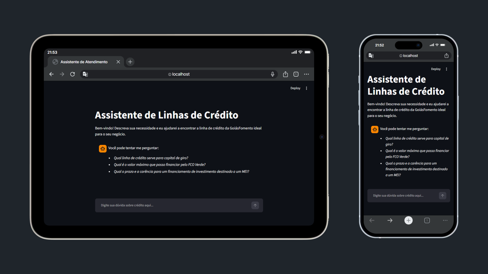

# Assistente de Atendimento de Linhas de Crédito 
---
<!--  -->

<div align="center">
  <a href="https://youtu.be/Oj_IFA3q8YA">
    
  </a>
</div>

## 1. Contexto e Problema

Em seu primeiro contato com a GoiásFomento, o empreendedor pode achar desafiador identificar, entre as diversas linhas de crédito disponíveis, aquela que realmente atende ao seu perfil e às suas necessidades. As normas de elegibilidade, as taxas, os prazos e a documentação requerida podem variar entre linhas, e nem sempre são claras para quem não tem conhecimento especializado.

Esse cenário acarreta outros efeitos indesejados:

- O empreendedor pode desistir ou demorar mais do que necessário para iniciar o processo;
- Congestionamento nos canais oficiais de comunicação e sobrecarga no atendimento.
- Funcionários ocupados com perguntas simples e repetitivas em vez de casos mais complexos.

## 2. Proposta de Solução

Um assistente conversacional, com o papel de **triagem inicial** no atendimento ao empreendedor. Ele:

- Recomenda a linha de crédito mais adequada;
- Explica quais documentos são exigidos e como funciona o processo, em linguagem acessível;
- Indica claramente os próximos passos, incluindo quando encaminhar o empreendedor ao atendimento humano.

A solução foi pensada para ser futuramente embarcada no ambiente Zaia, escalando a capacidade de atendimento da instituição com baixo custo.

## 3. Arquitetura Simples do MVP

O MVP foi desenhado apenas com as funções básicas, priorizando a simplicidade e a velocidade de implementação:

```
Usuário (empreendedor)
        │
        ▼
  Interface Streamlit
        │
        ▼
Prompt Mestre + Base de Conhecimento (Markdown)
        │
        ▼
     API Gemini
        │
        ▼
  Resposta ao usuário
```

Não há banco de dados ou infraestrutura complexa — a base de conhecimento é lida diretamente pelo prompt, e toda a "inteligência" de negócio está concentrada nas instruções dadas à IA. 

## 4. Dados Utilizados

Toda a base de conhecimento do assistente foi construída exclusivamente a partir de dados públicos disponíveis no site oficial da GoiásFomento, especificamente sobre a linha de crédito **FCO (Fundo Constitucional de Financiamento do Centro-Oeste)**:

- Público-alvo;
- Taxas de juros;
- Prazos e carência;
- Valores mínimos e máximos financiáveis;
- Documentação exigida;

Essas informações foram extraídas do site e reorganizadas em um formato estruturado (Markdown), servindo como a única fonte de conhecimento permitida para as respostas da IA. Nenhuma informação genérica sobre crédito é utilizada, o que reduz o risco de respostas incorretas e alucinações.

## 5. Limitações do MVP

Este protótipo possui escopo restrito com foco na validação rápida da ideia central:

- **Cobertura de linha de crédito:** atualmente, o assistente contempla apenas a linha FCO. Perguntas relacionadas a outras linhas de crédito da GoiásFomento são direcionadas à página correspondente do site oficial ou ao atendimento humano.
- **Base de conhecimento estática:** os dados foram coletados manualmente, sendo assim, não há atualização automática caso as regras da linha FCO sejam alteradas no site oficial.

## 6. Prompt Engineering

O comportamento do assistente foi moldado por instruções explícitas no prompt mestre, com as seguintes decisões de design:

- **Restrição de escopo ao FCO:** o prompt instrui a IA a responder apenas com base na linha FCO. Perguntas sobre outras linhas de crédito são identificadas e tratadas como fora do escopo atual.
- **Restrição à base de conhecimento:** a IA é instruída a nunca inventar informações. Se algo não estiver na base de dados, ela deve admitir isso explicitamente.
- **Linguagem acessível:** o tom foi calibrado para ser didático e acolhedor, considerando que o público pode não ter familiaridade com termos técnicos do setor financeiro.
- **Encaminhamento:** perguntas fora do escopo atual são respondidas com o direcionamento à página do site correspondente ou ao atendimento humano, em vez de resposta genérica.

## 8. Backlog do Produto

| Prioridade | Feature | Valor esperado |
|---|---|---|
| Alta | Atualização automática da base via scraping periódico do site | Manter dados sempre atualizados sem esforço manual |
| Alta | Arquitetura RAG (Retrieval-Augmented Generation) | Reduzir o custo de tokens |
| Alta | Integração com WhatsApp | Facilitar o acesso ao empreendedor |
| Média | Simulador de parcelas | Atendimento mais individualizado |
| Média | Encaminhamento automático para atendente humano em casos complexos | Evitar frustração |
| Média | Portar o motor de conhecimento para dentro do ecossistema Zaia | Aproveitar a infraestrutura de IA existente e escalar o atendimento |


